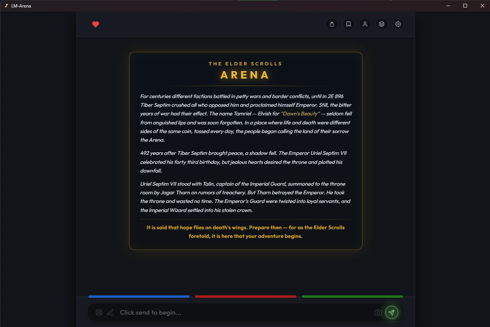

# LM-ARENA: THE ELDER SCROLLS TEXT ADVENTURE

An interactive, LLM-driven roleplaying text adventure recreating **The Elder Scrolls: Chapter I — Arena** (3E 389, The Imperial Simulacrum).

Embark on an epic journey across Tamriel to reconstruct the shattered **Staff of Chaos**, rescue Emperor Uriel Septim VII, and defeat the usurper Battlemage Jagar Tharn.

---

<p align="center">
  
</p>

---

## CORE FEATURES

### D20 Narrative Mechanics
* **Transparent Roll System**: Character attributes (0–100 scale, centered at 50) determine standard d20 ability modifiers: `(Attribute - 50) / 10`.
* **Collapsible Action Log**: Combat attacks, stealth checks, lockpicking attempts, and spellcasting rolls are handled via background tool executions. Numerical mechanics remain neatly tucked inside collapsible tool dropdowns, keeping chat narrative fluid and immersive.
* **Dynamic Vitals**: Track **Health (HP)**, **Magicka (MP)**, and **Stamina** with real-time exhaustion penalties for reckless exertion.

### Vast World of Tamriel
* **Nine Provinces**: Explore Cyrodiil, Skyrim, Morrowind, High Rock, Hammerfell, Summerset Isle, Valenwood, Elsweyr, and Black Marsh.
* **Main Quest Dungeons**: Infiltrate all 8 legendary fragment locations: Fang Lair, Labyrinthian, Elden Grove, Halls of Colossus, Crystal Tower, Crypt of Hearts, Murkwood, and Dagoth Ur, before storming the Imperial Palace.
* **Tamrielic Calendar**: Realistic day, month, and season progression across all twelve Tamrielic months.

### Character & Inventory System
* **Playable Heritages & Classes**: Full support for all 8 original heritages and 18 classic Arena classes (Warrior, Mage, Thief archetypes).
* **Backpack & Grimoire**: Equip and manage weapons, armor, shields, torches, and enchanted jewelry, or drop items from your pack.
* **Arena Spellmaker**: Design custom spells with dynamic school and tier calculations (Destruction, Restoration, Alteration, Illusion, Mysticism, Conjuration, Thaumaturgy, Sorcery).
* **Passive Traits**: Heritage traits (Nord Cold Resistance, Breton Magic Resistance, Dark Elf Fire Resistance) and class abilities (Sorcerer passive Spell Absorption).

### Companions & Guides
* **Ria Silmane**: The spectral former apprentice to Jagar Tharn, communicating through mystical dream visions to guide your quest.
* **Procedural Companions**: Meet, hire, and adventure with local sellswords, spellcasters, and rogues encountered across Tamriel's taverns and cities.

### Comprehensive Lorebook Engine
* **Bestiary**: Complete statistics and lore grounding for 22 iconic Arena monsters, beasts, and Daedric entities.
* **Artifacts**: 16 legendary Tamrielic relics including Chrysamere, the Staff of Magnus, Auriel's Bow & Shield, and the Oghma Infinium.
* **World Info**: Factions, Nine Divines, Daedric Princes, city services, taverns, temples, and blacksmiths.

---

## INTERFACE CONTROLS

* **Vitality Pulse (Top-Left)**: Click the heart vitality bar to inspect your Character Status sheet, Vitals, Attributes, and Active Effects.
* **Backpack (Pouch Icon)**: Inspect inventory items, equip gear, view your grimoire, and manage gold.
* **Quest Log (Bookmark Icon)**: Review active main quest objectives and current campaign stages.
* **Player & Saves (User Icon)**: Switch characters, adjust identity, or manage distinct save game slots.
* **Follower Journals (Layers Icon)**: Access companion journals, memories, and shared knowledge.
* **Settings (Gear Icon)**: Configure local LLM connections, cloud models, and ComfyUI image generation.

---

## GETTING STARTED

### Windows (Quick Start Native Desktop App):
Double-click `run_local.bat` (or run `./run_local.ps1` in PowerShell, or `./run_local.sh` on Linux/macOS).
This launches **LM-Arena** directly as a native standalone desktop application with EdgeChromium / WebView2 audio support and integrated local in-process engines.

### Recommended Model:
* **Recommended LLM**: [**Equinox-31B-i1-GGUF**](https://huggingface.co/mradermacher/Equinox-31B-i1-GGUF) (e.g. `Equinox-31B.i1-Q4_K_M.gguf`)
  * *High-fidelity Tamriel roleplay, nuanced dialogue, and autonomous D20/inventory tool calling.*

### Model Placement:
Place your model files in the designated subdirectories under `models/`:
* **Chat LLM (GGUF)**: `models/llm/` (e.g. `models/llm/Equinox-31B.i1-Q4_K_M.gguf`)
* **Portraits / Checkpoints (SDXL / SD 1.5)**: `models/checkpoints/`
* **LoRAs**: `models/loras/`
* **VAE**: `models/vae/`

### Manual Installation:
1. Open a terminal in the project directory:
   ```bash
   python -m venv .venv
   ```
2. Activate the virtual environment:
   * **Windows**: `.venv\Scripts\activate`
   * **Mac/Linux**: `source .venv/bin/activate`
3. Install dependencies:
   ```bash
   pip install -r requirements.txt
   ```
4. Start the native desktop application or web server:
   ```bash
   python desktop.py
   # Or for browser-only mode:
   python app.py
   ```
5. Navigate to **`http://localhost:5000`** (or your LAN hostname/IP at port `5000`) in your browser if running in web mode.

---

## PROJECT STRUCTURE

* **`desktop.py`**: Standalone native desktop application window with pywebview.
* **`app.py`**: Main Flask backend server and REST API endpoints.
* **`core/`**:
  * `engine_diffusion.py` & `comfy_engine/`: In-process GPU diffusion engine for portrait art generation.
  * `character.py`, `world_engine.py`, `side_quests.py`, `quest_tracker.py`, `save_manager.py`: RPG game logic and world state.
  * `followers/`: Companion profiles, dialogue scripts, and character cards (Ria Silmane).
  * `lorebooks/`: Lore grounding for Tamriel, bestiary, artifacts, and factions.
* **`runners/`**:
  * `engine_llm.py`, `local_runner.py`, `local_server.py`: In-process GGUF LLM execution and server process orchestration.
  * `runners.py`: Decoupled open-source runner backend.
* **`tools/tools.py`**: LLM gameplay tools for D20 skill checks, combat rolls, quest tracking, inventory, and portrait art generation.
* **`variables/`**: Game saves, settings, and banned words logit suppression dictionaries.
* **`static/` & `templates/`**: Responsive fantasy web UI, CSS styling, custom scroll app icons, and client logic.

